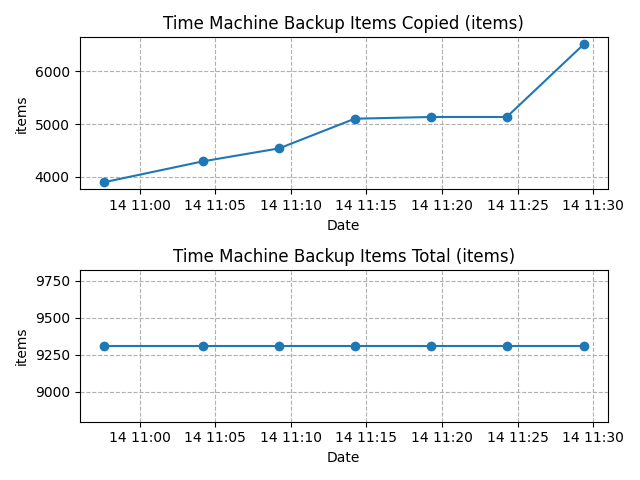

# Time Machine Analyzer

Time Machine Analyzer is a Python Application for analyzing the Time Machine Performance by parsing the log files and extracting the backup speed, size and amount of items to copy.
With this Python Application you can draw different graphs to visualize the performance of your Time Machine and analyze why and when the Backup gets stuck or takes longer than usual.

## Installation

1. Create a virtual environment by running the following command:

```bash
python3 -m venv env
```

2. Activate virtual environment

```bash
source env/bin/activate
```

3. Install needed requirements inside the virtual environment by running the following command:

```bash
python3 -m pip install -r requirements.txt
```

## Usage

To start the Application run the following command after activating the virtual environment:

```bash
python3 main.py
```

After starting the Application you need to enter the time range the analyzer should take into account when parsing the log file:

```bash
Enter time range <num>[m|h|d]:
```

Following input can be given to the Application:

| Input        | Meaning    | Description  |
|:-------------|:-------------|:-----|
| 1m     | 1 minute | Analyze all logs of the last minute |
| 1h     | 1 hour   | Analyze all logs of the last hour |
| 1d     | 1 day    | Analyze all logs of the last day |

After you are done you can leave the virtual environment by running the command

```bash
deactivate
```
## Example Output
After the Application was running successfully the following three graphs are produced for analyzing the Time Machine:

1. The first graph shows the Copy Speed of the Time Machine in MB/s and items/s to the Time Capsule or any other external drive:
")

2. The second graph shows how many GBs were already copied to the Backup drive and how much in total needs to be copied:
")

3. The third graph shows how many items were already copied to the Backup drive and how much items in total needs to be copied:


Besides the three graphs an additional CSV file is created containing all log entries in the following format:

Date | Bytes Copied | Bytes to Copy | Items Copied | Items to Copy | Bytes per Second | Items per Second | Last Path Seen
|:---|:-------------|:--------------|:-------------|:--------------|:-----------------|:-----------------|:-------------|
| The date this log entry was created | Number of bytes copied to backup drive | Total number of Bytes to copy to backup drive | Number of items to copy to backup drive | Total number of items to copy to backup drive | Copy speed in bytes per second | Copy speed in items per second | Last path backed up while this log file was created |

## Contributing
Pull requests are welcome. For major changes, please open an issue first to discuss what you would like to change.

Please make sure to update tests as appropriate.

## License
[MIT](https://choosealicense.com/licenses/mit/)